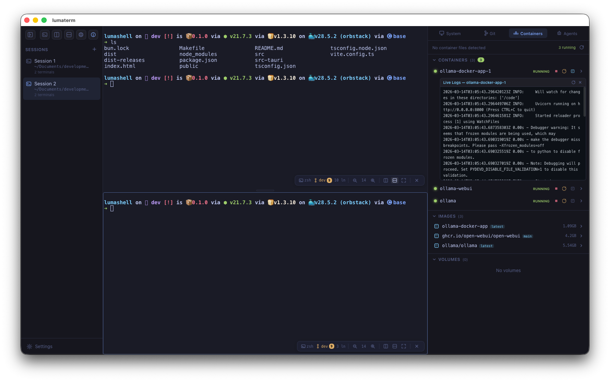

# LumaShell

A modern terminal emulator built with Tauri 2, React 19, and xterm.js. Features multi-pane splits, git integration, Docker management, and an AI agents panel.



## Prerequisites

- [Rust](https://rustup.rs/) (latest stable)
- [Bun](https://bun.sh/) (or Node.js 18+)
- Platform-specific Tauri dependencies — see [Tauri prerequisites](https://v2.tauri.app/start/prerequisites/)

## Setup

```bash
git clone <repo-url> && cd lumashell
bun install
```

## Development

```bash
make run
# or: bun run tauri dev
```

Starts Vite on `localhost:1420` with HMR and launches the Tauri window.

## Production Build

```bash
make build                # Current platform
make build-mac            # macOS universal (ARM + Intel)
make build-mac-arm        # macOS ARM64
make build-mac-intel      # macOS x86_64
make build-linux-x64      # Linux x86_64
make build-linux-arm      # Linux ARM64
make build-all            # All platforms
```

Build output: `src-tauri/target/release/bundle/`

## Project Structure

```
lumashell/
├── src/                  # Frontend (React + TypeScript)
│   ├── components/       # UI — TerminalPane, GitPanel, DockerPanel, etc.
│   ├── addons/           # Feature modules (git, containers, agents, system)
│   ├── hooks/            # Custom hooks (use-pty)
│   ├── lib/              # Utilities (keybindings, theme, split-tree)
│   └── state/            # Zustand store
├── src-tauri/            # Backend (Rust)
│   ├── src/
│   │   ├── commands.rs   # Tauri IPC command handlers
│   │   ├── pty_manager.rs# PTY lifecycle management
│   │   └── git_watcher.rs# File system watcher for git status
│   └── tauri.conf.json   # App window & bundle config
├── Makefile              # Build automation
└── package.json          # Frontend dependencies & scripts
```

## Tech Stack

| Layer    | Technology                        |
|----------|-----------------------------------|
| Frontend | React 19, TypeScript, Vite 6      |
| Terminal | xterm.js 5.5                      |
| State    | Zustand 5                         |
| Backend  | Rust, Tauri 2, portable-pty 0.8   |
| Bundler  | Bun                               |
